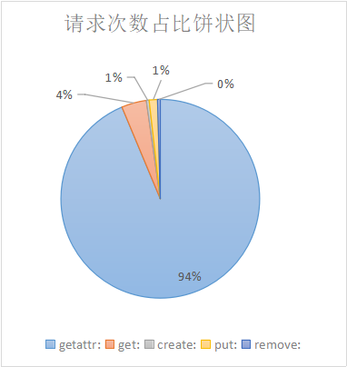

# lab1 + plus

## 张澳  518021910368

### CPU主频：2304 MHZ

​															图1.cpu主频

### 1.native file system 测试结果

 															图2.native file system测试结果

native file system最好成绩255 works/sec,后又测了大概20次左右（期间尝试重启docker服务），正常情况下效率应该在250 works/sec左右，于是择中选择250 works/sec左右作为native file system的标准

### 2. 首先考虑到大量print操作写入log文件会耗时，所以先行注释掉之前用来debug的print指令

​													              图3.未注释print前 YFS测试结果

未注释掉print前最好效率在50works/sec左右，重复测取多次，去除偏差过大的值，取45works/sec作为原来的lab1的执行效率

 														图4.注释print后 YFS测试结果

注释掉print后，效率获得明显提升，基本都会完成768works，测试多次，取中值140works/sec

### 3.找性能瓶颈

测试每个请求耗时（extent_client）内，结果如下：

​														表1.extent_client对不同函数调用次数以及耗时统计表(对inode缓存前)

​														图5.请求次数占比饼状图

​														图6.函数调用占据时间占比饼状图

由上图可以发现，getattr函数调用次数是最多的，也是耗时占比最大的，尝试用增加cache的方法降低getattr的耗时。

具体实现为在inode_manager层增加inode_cache,因为getattr只需要访问inode中的数据，在增加了cache后，就不用每次都从磁盘读取，从而大大缩短读取文件信息时间。加入cache后的耗时测试结果如下：

​														表2.extent_client对不同函数调用次数以及耗时统计表(对inode缓存后)

可以看到，对inode缓存后，各个函数的平均耗时都大大降低!

| 平均耗时 | 增加cache前（cycles） | 增加cache后        | 优化率          |
| -------- | --------------------- | ------------------ | --------------- |
| getattr: | get:394.9580602       | create:1541.880249 | put:0.743846476 |
| get:     | 2268.899984           | 4916.801247        | 0.538541448     |
| create:  | 2827.806863           | 4576.552262        | 0.382109785     |
| put:     | 17252.36613           | 38208.8152         | 0.548471575     |
| remove:  | 9889.287886           | 23676.20313        | 0.582311073     |

 														图7.增加cache后 YFS测试结果

### 多次测试，最终结果基本稳定在196work/sec左右，效率提升到了Native File System的78.4%

